# tech_blog_app

## Description
This is an application that simulates a blog website with the ability for a user to create an account, create blog posts as well as the ability to edit or delete their existing blog post(s). The user can also comment on pre-existing blog posts from other accounts as well. The user must sign in to be able to access the ability to create, blog posts and/or comment on blog posts. If the user tries to access the dashboard page without having first created an account and logging into an account, they will be immediately redirected to the login page to login or sign up for an account if they do not have one. This project utilizes express-session as well as connect-sequelize-session in order to persist user credentials through session and cookies.

## Installation

## Usage

When you first open the site, you will see the home page where you will be able to read existing blog posts from other users 

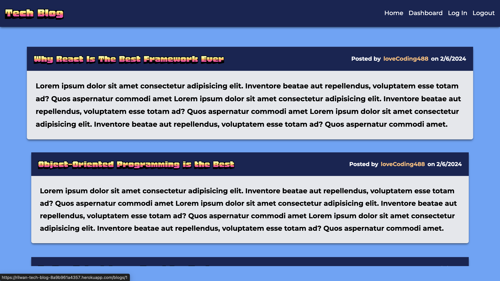  

You will also be able view comments from other users and seen which user commented on the post and the timestamp when they created it  

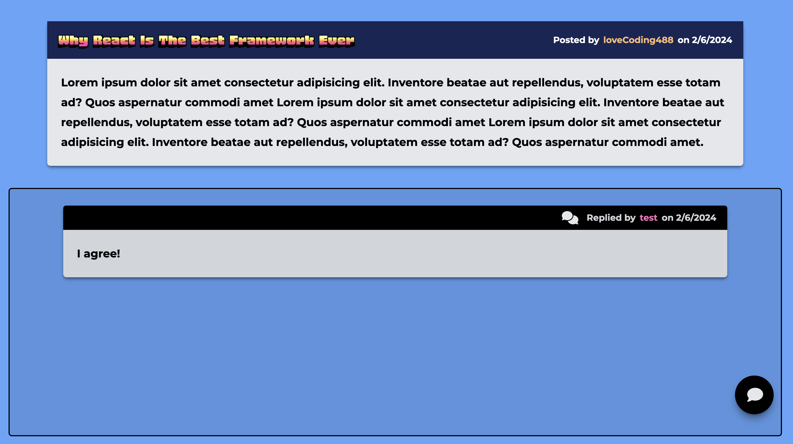  

If you try to comment on a post or access the dashboard, you will be redirected to login, or sign up for an account if you don't have one  

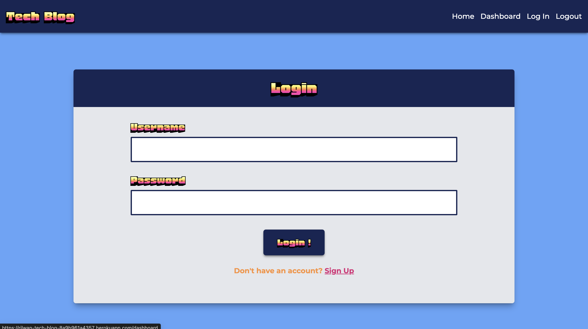  

Once you have signed up for an account you will be able to login with the username and password you have created and access your dashboard.  

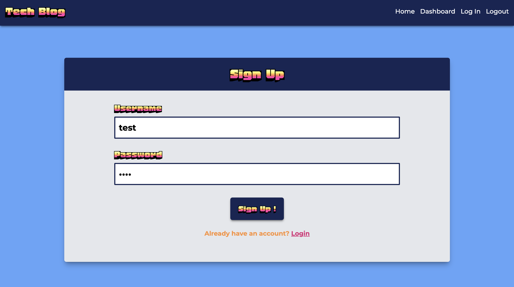  

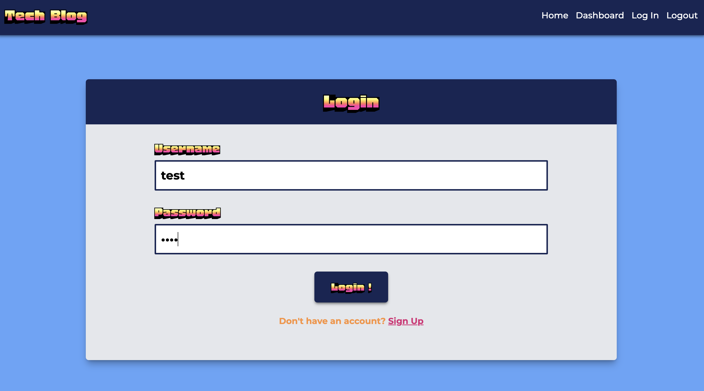  

Once you log in, you will be redirected to the dashboard, where you can add blogpost and keep track of the blogpost you have created

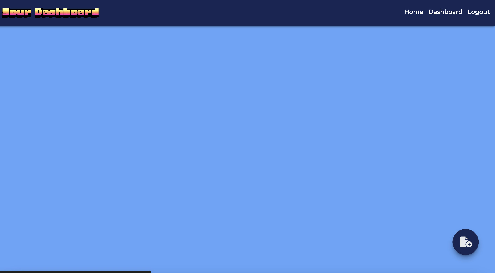  

creating a New Post 

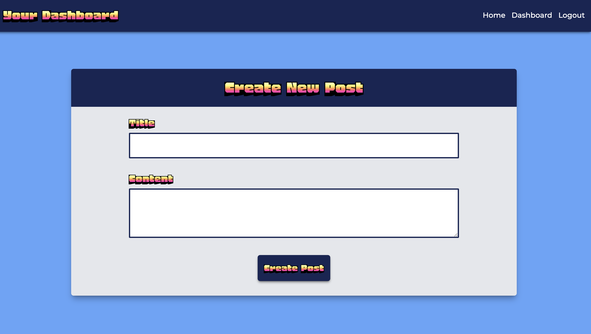  

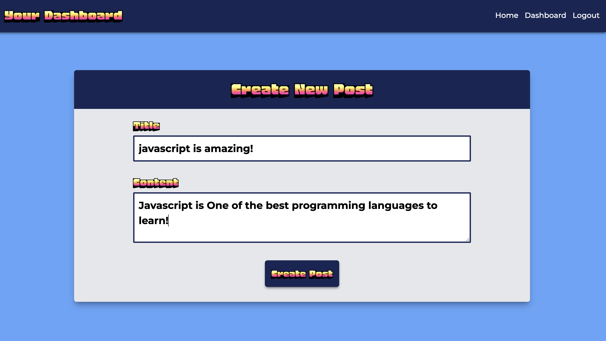  

New Post being added to your dashboard  

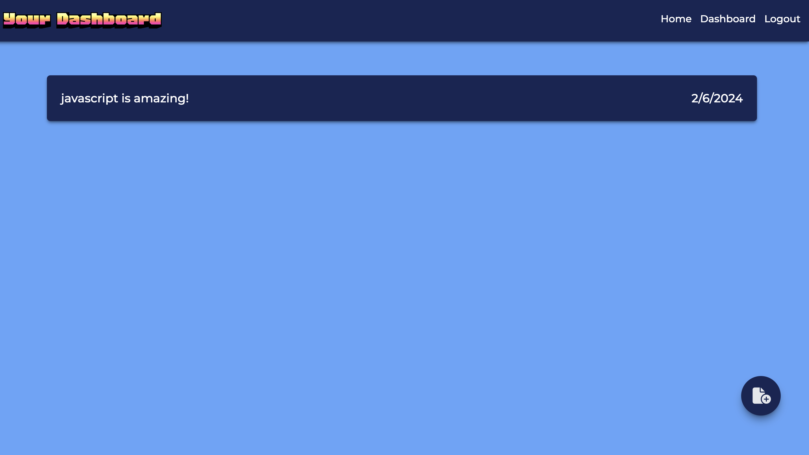

New Post being added to homepage  

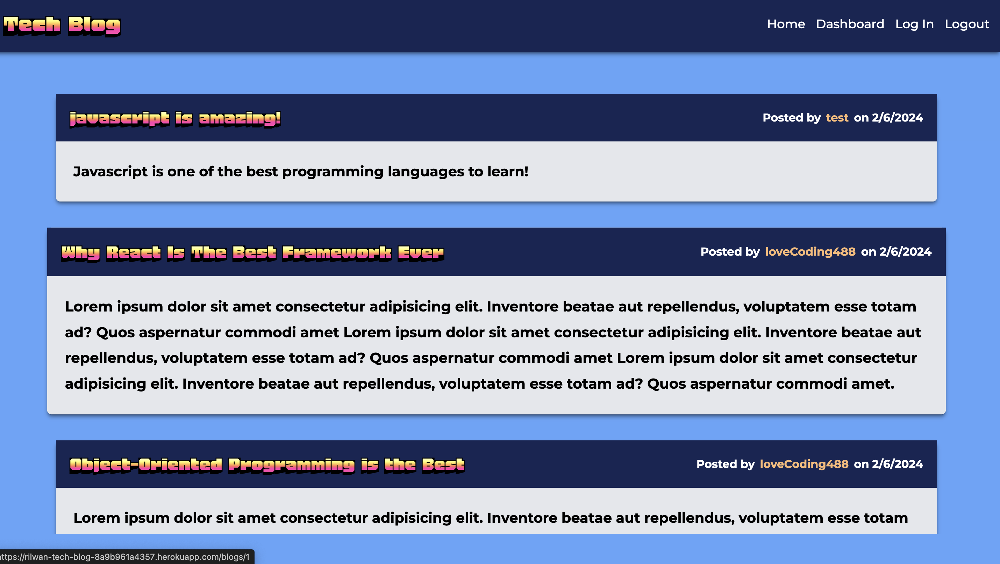

Editing your post with the option to delete

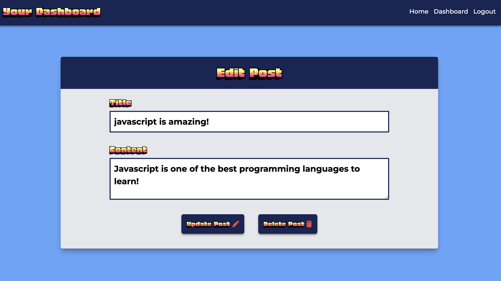

## Links

Link to GitHub Repository: https://github.com/Rilwan0410/tech_blog_app  

Link to Deployed Application on Heroku: https://rilwan-tech-blog-163398da0ed1.herokuapp.com/  
